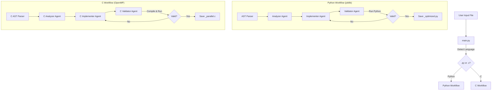

# Auto-Parallelization Multi-Agent System 🚀

An intelligent agentic system that automatically optimizes code by identifying slow sequential loops and refactoring them into parallel implementations.

**Supported Languages:**
- 🐍 **Python** → Parallelized using `joblib` (Loops)
- ⚡ **C** → Parallelized using `OpenMP` (**Loops & Task Parallelism**)

## 🏗️ Architecture

The system uses **LangGraph** to coordinate specialized AI agents with language-specific workflows and a consistent feedback loop.



## ✨ Features

### Common Features
-   **Static Analysis (AST)**: Mathematically precise identification of loops and variables before the AI sees the code.
-   **Multi-Agent Workflow**: Analyzer → Implementer → Validator pipeline with retry loops.
-   **Safe Execution**: Runs validation in temporary sandboxes that are automatically cleaned up.
-   **No Hallucinations**: Code is strictly validated by execution, not just by "looking valid".

### Python-Specific
-   🕵️ **Analyzer**: Uses Python `ast` module + LLM reasoning to find parallelizable loops.
-   👷 **Implementer**: Refactors using `joblib.Parallel` and `delayed`.
-   ✅ **Validator**: Generates Python test scripts to verify output correctness and speedup.

### C-Specific (OpenMP)
-   🕵️ **Analyzer**: Uses `pycparser` + LLM to detect:
    -   **Data Parallelism**: Loops with reduction patterns, private/shared variables.
    -   **Task Parallelism**: Independent code blocks (using RAW/WAR/WAW analysis) for `#pragma omp sections`.
-   👷 **Implementer**: Adds `#pragma omp parallel for` or `#pragma omp parallel sections`.
-   ✅ **Validator**: Compiles with `gcc -fopenmp`, measures execution time, and provides **Speedup Reports**.

## 🚀 Getting Started

### Prerequisites

-   Python 3.10+
-   Mistral AI API Key (Devstral recommended)
-   **For C support**: GCC with OpenMP support (`gcc -fopenmp`)

### Installation

1.  Clone the repository.
2.  Install dependencies:
    ```bash
    pip install -r requirements.txt
    ```
3.  Configure your environment variables in `.env`:
    ```ini
    model=devstral-2512
    api_key=your_mistral_api_key
    base_url=https://api.mistral.ai/v1
    ```

4.  **(For C support)** Ensure GCC with OpenMP is installed:
    ```bash
    # Ubuntu/Debian
    sudo apt install gcc
    
    # macOS (with Homebrew)
    brew install gcc
    
    # Windows (MinGW-w64 or WSL recommended)
    # Download from: https://winlibs.com/
    ```

## 💻 Usage

### Python Files

```bash
# Auto-detect language from extension
python main.py path/to/your_script.py

# Specify custom output
python main.py script.py -o optimized_script.py
```

### C Files

```bash
# Auto-detect language from extension
python main.py path/to/program.c

# Specify custom output
python main.py program.c -o program_omp.c

# Force language (for non-standard extensions)
python main.py code.txt --language c
```

### CLI Options

```
usage: main.py [-h] [--output OUTPUT] [--language {python,c}] input_file

positional arguments:
  input_file            Path to the source file (.py for Python, .c for C)

optional arguments:
  -h, --help            Show this help message and exit
  --output, -o OUTPUT   Path to save the optimized code
  --language, -l {python,c}
                        Force language (auto-detected from extension if not specified)
```

## 📝 Examples

### Python Example

**Input (`workload.py`)**:
```python
def main():
    results = []
    for i in range(10):
        results.append(slow_function(i))
```

**Output (`workload_optimized.py`)**:
```python
from joblib import Parallel, delayed

def main():
    results = Parallel(n_jobs=-1)(delayed(slow_function)(i) for i in range(10))
```

### C Example

**Input (`sum_array.c`)**:
```c
#include <stdio.h>

int main() {
    int arr[1000];
    int sum = 0;
    
    for (int i = 0; i < 1000; i++) {
        arr[i] = i;
    }
    
    for (int i = 0; i < 1000; i++) {
        sum += arr[i];
    }
    
    printf("Sum: %d\n", sum);
    return 0;
}
```

**Output (`sum_array_parallel.c`)**:
```c
#include <stdio.h>
#include <omp.h>

int main() {
    int arr[1000];
    int sum = 0;
    
    #pragma omp parallel for
    for (int i = 0; i < 1000; i++) {
        arr[i] = i;
    }
    
    #pragma omp parallel for reduction(+:sum)
    for (int i = 0; i < 1000; i++) {
        sum += arr[i];
    }
    
    printf("Sum: %d\n", sum);
    return 0;
}
```

### C Task Parallelism Example (Sections)

**Input (`tasks.c`)**:
```c
int main() {
    heavy_task_1();
    heavy_task_2();
    return 0;
}
```

**Output (`tasks_parallel.c`)**:
```c
int main() {
    #pragma omp parallel sections
    {
        #pragma omp section
        heavy_task_1();

        #pragma omp section
        heavy_task_2();
    }
    return 0;
}
```

## 📊 Performance Reporting

MAAP now provides a **Speedup Report** after every successful validation:

```text
=== PERFORMANCE REPORT ===
Original Time: 5.3615s
Parallel Time: 1.4502s
Speedup:      3.69x
==========================
```

## 📂 Project Structure

```
MAAP/
├── main.py                 # CLI entry point with language detection
├── graphs/
│   └── workflow.py         # LangGraph state machine with dual workflows
├── agents/
│   ├── analyser.py         # Python loop analyzer
│   ├── implementer.py      # Python joblib implementer
│   ├── validator.py        # Python validation script generator
│   ├── ast_utils.py        # Python AST walker utility
│   ├── c_analyser.py       # C loop analyzer (OpenMP-focused)
│   ├── c_implementer.py    # C OpenMP pragma implementer
│   ├── c_validator.py      # C compilation & validation generator
│   └── c_ast_utils.py      # C AST parser using pycparser
├── LLMs/
│   └── azure_models.py     # Mistral/LLM configuration
├── temp_env/               # (Ephemeral) Python validation sandbox
├── temp_env_c/             # (Ephemeral) C compilation sandbox
└── requirements.txt
```

## 🔧 Requirements

| Dependency | Purpose |
|------------|---------|
| `langchain-mistralai` | Mistral AI integration |
| `langgraph` | Stateful agent workflow graphs |
| `pycparser` | C code AST parsing |
| `joblib` | Python parallel execution |
| `python-dotenv` | Environment variable loading |

## ⚠️ Limitations

- **C Preprocessing**: `pycparser` requires preprocessed C code. Complex `#include` chains may need manual preprocessing with `gcc -E`.
- **OpenMP Support**: The target system must have GCC/Clang with OpenMP support installed.
- **Data Dependencies**: The AI attempts to detect dependencies, but complex pointer aliasing in C may be missed.

## 📄 License

MIT License - See LICENSE file for details.
