# MAAP: Multi-Agentic for Auto Parallelization

MAAP is an intelligent system that automatically parallelizes **Python** and **C** code using specialized AI agents. It identifies CPU-bound loops, independent task graphs, and vectorizable operations, then refactors the code to use **joblib**, **concurrent.futures** (Python), or **OpenMP** (C).

## 🚀 Key Features

1.  **Smart Analysis**: Detects parallelizable patterns:
    *   **Loop Map**: Independent iterations (CPU-bound).
    *   **Task Graph**: Independent function calls.
    *   **Vectorization**: Numeric loops convertible to NumPy.
    *   **Reduction**: Accumulation loops (experimental support).
2.  **Auto-Refactoring**: Implements robust parallel backends:
    *   **Processes**: For CPU-heavy work (bypasses GIL).
    *   **Threads**: For I/O-bound work.
3.  **Agentic Validation**: Automatically generates a test script to verify **Correctness** and report **Speedup**.
4.  **Structured Output**: detailed reports and artifacts saved to `output/<filename>/`.

## 📦 Installation

```bash
# Clone repository
git clone https://github.com/mustafa200312/MultiAgentic_for_AutoPara.git
cd MultiAgentic_for_AutoPara

# Create virtual environment
python -m venv .venv
source .venv/bin/activate  # or .venv\Scripts\activate on Windows

# Install dependencies
pip install langgraph langchain langchain-mistralai pydantic joblib python-dotenv pycparser
```

### 🧰 C Language Prerequisites
To use the C parallelization features, you must have GCC installed and accessible in your system PATH.
*   **Windows**: Install [MinGW-w64](https://www.mingw-w64.org/) or use WSL.
*   **Linux/Mac**: Typically pre-installed or available via `sudo apt install gcc` / `brew install gcc`.

## ⚙️ Configuration

Create a `.env` file in the project root:

```ini
MISTRAL_API_KEY=your_mistral_api_key_here
```

## 🛠️ Usage

Let the Agent automatically analyze, optimize, and create a validation test for your script:

```bash
python main.py demo_workload.py
```

**Results in `output/demo_workload/`**:
*   `optimized.py`: Parallelized code.
*   `report.txt`: Validation log (Time, Speedup, Correctness).
*   `validation_script.py`: The generated test harness.

## 🧠 System Architecture

The system uses a **LangGraph** workflow with three primary agents. The workflow automatically routes based on file extension (`.py` or `.c`).

```mermaid
flowchart TD
    A[📄 Input File] --> B{File Extension?}
    
    B -->|.py| C[🔍 Python Analyzer]
    B -->|.c| D[🔍 C Analyzer]
    
    C --> E[⚡ Python Implementer]
    D --> F[⚡ C Implementer]
    
    E --> G[✅ Python Validator]
    F --> H[✅ C Validator]
    
    G --> I{Valid?}
    H --> I
    
    I -->|Yes| J[📁 optimized.py/.c]
    I -->|No, Retry < 3| E
    I -->|No, Retry < 3| F
    I -->|No, Max Retries| K[📁 optimized_FAILED.py/.c]
    
    subgraph "Python Path"
        C
        E
        G
    end
    
    subgraph "C/OpenMP Path"
        D
        F
        H
    end
    
    style A fill:#e1f5fe
    style J fill:#c8e6c9
    style K fill:#ffcdd2
```



### Agent Responsibilities:

| Agent | Python | C/OpenMP |
|-------|--------|----------|
| **Analyzer** | AST + LLM analysis for `loop_map`, `task_graph`, `vectorize` | AST + LLM analysis for OpenMP opportunities |
| **Implementer** | Applies `joblib` / `concurrent.futures` | Applies `#pragma omp parallel for`, `simd` |
| **Validator** | Generates Python test script | Generates script to compile & run with `gcc` |

---

## 🔍 Analyzer Deep Dive

Both analyzers use a combination of **Static AST Analysis** + **LLM Reasoning** to identify parallelization opportunities. They share a unified output format for consistency.

### Structured Output Format

Both analyzers output a list of **Candidates** with the following fields:

| Field | Description |
|-------|-------------|
| `id` | Unique identifier (e.g., `C001`, `P002`) |
| `type` | Pattern classification (see below) |
| `start_line` / `end_line` | 1-indexed line range in source |
| `parallelizable` | `yes` / `maybe` / `no` |
| `reason` | Short explanation of the decision |
| `blockers` | List of concrete issues preventing parallelization |
| `recommendation` | Suggested implementation strategy |
| `validation_checks` | 2-5 concrete checks for the validator |

### Python Analyzer (`agents/analyser.py`)

**Candidate Types:**
| Type | Description | Recommendation |
|------|-------------|----------------|
| `loop_map` | Independent iterations producing per-item outputs | `process_pool` / `thread_pool` |
| `reduction` | Accumulator pattern (`sum += ...`) | `process_pool` with chunking |
| `io_batch` | Multiple I/O operations (network, file) | `thread_pool` / `asyncio` |
| `task_graph` | Independent function calls (DAG style) | `concurrent.futures` |
| `vectorize_candidate` | Numeric loops → NumPy/Numba | `vectorize` |
| `pipeline_stage` | Read → Transform → Write stages | `pipeline` |

**Prompt Strategy:**
1. Receives source code + AST loop report with line ranges
2. Classifies each code region into one of the candidate types
3. Evaluates safety: checks for shared mutable state, carried state, side effects
4. Recommends backend: `process_pool` for CPU-bound, `thread_pool` for I/O-bound

### C Analyzer (`agents/c_analyser.py`)

**Candidate Types:**
| Type | Description | OpenMP Pragma |
|------|-------------|---------------|
| `loop_map` | Independent for-loop iterations | `#pragma omp parallel for` |
| `reduction` | Accumulator pattern | `#pragma omp parallel for reduction(+:sum)` |
| `task_graph` | Independent code blocks | `#pragma omp parallel sections` |
| `vectorize` | SIMD-friendly inner loops | `#pragma omp simd` |

**Prompt Strategy:**
1. Receives source code + AST report from `pycparser`
2. Identifies loops and checks for loop-carried dependencies
3. Evaluates thread safety: pointer aliasing, function side effects
4. Recommends OpenMP pragma: `parallel_for`, `parallel_for_reduction`, `parallel_sections`, `simd`

### Example Output

```
C Analysis Summary (OpenMP): Two main loops suitable for parallelization...

Candidates:
- [ID: C001] Type: loop_map, Lines: 10-10, Parallelizable: yes
  (Independent iterations, no dependencies)
  Recommendation: parallel_for
- [ID: C002] Type: loop_map, Lines: 13-18, Parallelizable: yes
  (CPU-bound with independent iterations)
  Recommendation: parallel_for
- [ID: C003] Type: vectorize, Lines: 15-17, Parallelizable: maybe
  (Inner loop with function calls needs validation)
  Recommendation: simd
```

---

## ⚡ Implementer Deep Dive

Both implementers transform analyzed code into parallelized versions. They share a unified output format for tracking changes.

### Structured Output Format

Both implementers output:
- `modified_code`: The complete parallelized source code
- `parallelizable`: Boolean indicating if any changes were made
- `changes`: List of applied modifications

**Change Tracking Fields:**
| Field | Description |
|-------|-------------|
| `start_line` / `end_line` | Line range modified |
| `backend` (Python) / `pragma` (C) | Parallelization method used |
| `note` | Short explanation of the change |

### Python Implementer (`agents/implementer.py`)

**Supported Backends:**
| Backend | Use Case | Implementation |
|---------|----------|----------------|
| `processes` | CPU-bound work | `Parallel(n_jobs=-1, prefer="processes")` |
| `threads` | I/O-bound work | `Parallel(n_jobs=4, prefer="threads")` |

**Example Output:**
```
Implementer Changes:
  - Lines 15-22: Backend=processes (Parallelized CPU-bound loop)
  - Lines 30-35: Backend=threads (Parallelized I/O operations)
```

### C Implementer (`agents/c_implementer.py`)

**Supported Pragmas:**
| Pragma | Use Case | OpenMP Directive |
|--------|----------|------------------|
| `parallel_for` | Independent loop iterations | `#pragma omp parallel for` |
| `parallel_for_reduction` | Accumulator patterns | `#pragma omp parallel for reduction(+:sum)` |
| `parallel_sections` | Independent code blocks | `#pragma omp parallel sections` |
| `simd` | Inner loop vectorization | `#pragma omp simd` |

**Example Output:**
```
C Implementer Changes:
  - Lines 10-10: Pragma=parallel_for (Parallelized initialization loop)
  - Lines 13-20: Pragma=parallel_for (Parallelized CPU-bound loop)
```

---

## 🎯 Supported Patterns

MAAP optimizes the following code patterns:

1.  **CPU-Bound Loops (`loop_map`)**
    *   *Detection*: Loops performing heavy calculations (math, image processing) on independent items.
    *   *Python*: Distributed across CPU cores using `joblib` (Process Backend).
    *   *C*: `#pragma omp parallel for`
    *   *Benefit*: Bypasses Python's GIL / Uses all CPU cores.

2.  **I/O-Bound Loops (`io_batch`)**
    *   *Detection*: Loops waiting on network requests, file I/O, or database queries.
    *   *Python*: Concurrently executed using `ThreadPoolExecutor`.
    *   *Benefit*: Drastically reduces wait time by overlapping operations.

3.  **Task Graphs (`task_graph`)**
    *   *Detection*: Independent function calls that don't rely on each other's immediate output.
    *   *Python*: Scheduled as concurrent futures.
    *   *C*: `#pragma omp parallel sections`
    *   *Benefit*: Runs distinct stages of your pipeline at the same time.

4.  **Vectorization (`vectorize`)**
    *   *Detection*: Element-wise operations on lists/arrays.
    *   *Python*: Suggests NumPy/Numba replacements.
    *   *C*: `#pragma omp simd`
    *   *Benefit*: Leverages SIMD instructions for data-level parallelism.
