# MAAP: Multi-Agentic for Auto Parallelization

MAAP is an intelligent system that automatically parallelizes Python code using specialized AI agents. It identifies CPU-bound loops, independent task graphs, and vectorizable operations, then refactors the code to use **ProcessPoolExecutor**, **ThreadPoolExecutor**, or **joblib**.

## 🚀 Key Features

1.  **Smart Analysis**: Detects parallelizable patterns:
    *   **Loop Map**: Independent iterations (CPU-bound).
    *   **Task Graph**: Independent function calls.
    *   **Vectorization**: Numeric loops convertible to NumPy.
    *   **Reduction**: Accumulation loops (experimental support).
2.  **Auto-Refactoring**: Implements robust parallel backends:
    *   **Processes**: For CPU-heavy work (bypasses GIL).
    *   **Threads**: For I/O-bound work.
3.  **Agentic Validation**: Automatically generates a test script to verify **Correctness** and report **Speedup**.
4.  **Structured Output**: detailed reports and artifacts saved to `output/<filename>/`.

## 📦 Installation

```bash
# Clone repository
git clone https://github.com/mustafa200312/MultiAgentic_for_AutoPara.git
cd MultiAgentic_for_AutoPara

# Create virtual environment
python -m venv .venv
source .venv/bin/activate  # or .venv\Scripts\activate on Windows

# Install dependencies
pip install langgraph langchain langchain-mistralai pydantic joblib python-dotenv pycparser
```

### 🧰 C Language Prerequisites
To use the C parallelization features, you must have GCC installed and accessible in your system PATH.
*   **Windows**: Install [MinGW-w64](https://www.mingw-w64.org/) or use WSL.
*   **Linux/Mac**: Typically pre-installed or available via `sudo apt install gcc` / `brew install gcc`.

## ⚙️ Configuration

Create a `.env` file in the project root:

```ini
MISTRAL_API_KEY=your_mistral_api_key_here
```

## 🛠️ Usage

Let the Agent automatically analyze, optimize, and create a validation test for your script:

```bash
python main.py demo_workload.py
```

**Results in `output/demo_workload/`**:
*   `optimized.py`: Parallelized code.
*   `report.txt`: Validation log (Time, Speedup, Correctness).
*   `validation_script.py`: The generated test harness.

## 🧠 System Architecture

The system uses a **LangGraph** workflow with three primary agents. The workflow automatically routes based on file extension (`.py` or `.c`).

```mermaid
flowchart TD
    A[📄 Input File] --> B{File Extension?}
    
    B -->|.py| C[🔍 Python Analyzer]
    B -->|.c| D[🔍 C Analyzer]
    
    C --> E[⚡ Python Implementer]
    D --> F[⚡ C Implementer]
    
    E --> G[✅ Python Validator]
    F --> H[✅ C Validator]
    
    G --> I{Valid?}
    H --> I
    
    I -->|Yes| J[📁 optimized.py/.c]
    I -->|No, Retry < 3| E
    I -->|No, Retry < 3| F
    I -->|No, Max Retries| K[📁 optimized_FAILED.py/.c]
    
    subgraph "Python Path"
        C
        E
        G
    end
    
    subgraph "C/OpenMP Path"
        D
        F
        H
    end
    
    style A fill:#e1f5fe
    style J fill:#c8e6c9
    style K fill:#ffcdd2
```



### Agent Responsibilities:

| Agent | Python | C/OpenMP |
|-------|--------|----------|
| **Analyzer** | AST + LLM analysis for `loop_map`, `task_graph`, `vectorize` | AST + LLM analysis for OpenMP opportunities |
| **Implementer** | Applies `joblib` / `concurrent.futures` | Applies `#pragma omp parallel for`, `simd` |
| **Validator** | Generates Python test script | Generates script to compile & run with `gcc` |


## 🎯 Supported Patterns

MAAP optimizes the following code patterns:

1.  **CPU-Bound Loops (`loop_map`)**
    *   *Detection*: Loops performing heavy calculations (math, image processing) on independent items.
    *   *Optimization*: Distributed across CPU cores using `joblib` (Process Backend).
    *   *Benefit*: Bypasses Python's GIL for true parallelism.

2.  **I/O-Bound Loops (`io_batch`)**
    *   *Detection*: Loops waiting on network requests, file I/O, or database queries.
    *   *Optimization*: Concurrently executed using `ThreadPoolExecutor`.
    *   *Benefit*: Drastically reduces wait time by overlapping operations.

3.  **Task Graphs (`task_graph`)**
    *   *Detection*: Independent function calls that don't rely on each other's immediate output.
    *   *Optimization*: Scheduled as concurrent futures.
    *   *Benefit*: Runs distinct stages of your pipeline at the same time.

4.  **Vectorization (`vectorize`)**
    *   *Detection*: Element-wise operations on lists/arrays.
    *   *Optimization*: Suggests or implements NumPy/Numba replacements (if dependencies allow).